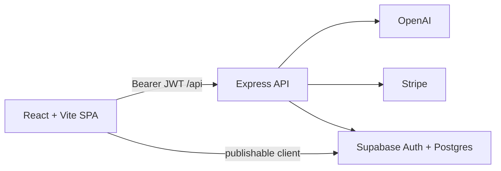

# FamilyFlow

Activities that fit what your family can handle right now.

[Live Demo](https://familyflow.app) *(placeholder — set to your production URL when deployed)*

**React · Express · Supabase · OpenAI · Stripe · Playwright**

Parents name the moment they are in. Kids pick energy and style. Generative AI proposes activities; deterministic scoring ranks them against the live moment, inventory, and historical outcomes—so the next suggestion is more likely to buy real uninterrupted time.

## Screenshots

*Placeholders — drop real captures here when you have them.*

| Screen | What to show |
|--------|----------------|
| **Parent Moment** | Moment cards / Rescue Mode; availability, time, space, mess, noise, supervision |
| **Kid Mode** | Energy + Simple vs Imaginative; “I’m Bored” / Quick ideas on a kid-device posture |
| **Activity (Quest)** | Suggestion cards, timer, steps/hints, independence outcome after finish |
| **Insights** | “What works for us” patterns from recent sessions and history |

## Architecture



Locally, Vite serves the SPA on `:5173` and proxies `/api` to Express on `:3001`. In production, Express serves `/api` and the built `dist/` SPA from one origin.

## Engineering highlights

- **Anonymous → permanent auth** — Try the free flow with Supabase anonymous sign-in; signup converts the same user so settings and favorites survive.
- **Server-trusted subscriptions** — Plus entitlement is derived on the server from `subscriptions`, not client flags.
- **Stripe webhooks** — Idempotent event ledger; handlers retrieve the current Stripe subscription before write to survive retries and out-of-order delivery.
- **AI structured output** — Activity suggestions and quest-step hints validated against server schemas.
- **Fit Score** — Deterministic ranking blends moment/inventory fit with past session outcomes (independence, duration, repetition).
- **Feedback learning** — Post-activity independence labels feed session memory and the next rank.
- **Activity sessions** — Start/finish lifecycle persisted via family-memory APIs (`activity_sessions`).
- **Cloud memory** — Favorites, history events, and sessions sync through Supabase for signed-in users.
- **Playwright CI isolation** — E2E runs against local Supabase (`supabase start` in Docker) plus Stripe test keys; production Supabase is never wired into the E2E job.
- **Rate limiting & CSP** — Per-route AI/auth/billing limits; Helmet CSP allowlists Stripe, Supabase, and fonts in production.

Longer product walkthrough: [`OWNERS_GUIDE.md`](./OWNERS_GUIDE.md). Portfolio narrative: [`docs/CASE_STUDY.md`](./docs/CASE_STUDY.md).

## Setup

1. Install dependencies:

```bash
npm install
```

2. Create environment files:

```bash
cp server/.env.example server/.env
cp .env.example .env
```

3. Fill required vars (see `server/.env.example` and `.env.example`).

   Billing needs `STRIPE_WEBHOOK_SECRET` at boot—locally run `stripe listen --forward-to localhost:3001/api/billing/webhook` and paste the `whsec_…` value.

4. Apply Supabase migrations so tables match the repo.

5. Start both processes:

```bash
npm run start:all
```

- Frontend: [http://localhost:5173](http://localhost:5173)
- Backend: [http://localhost:3001](http://localhost:3001)

In development, Vite proxies `/api` to the backend, so the frontend can use relative API URLs.

## E2E and CI

Playwright boots the app with `npm run start:all` and creates anonymous Supabase users. CI uses **local Supabase** (Docker via `supabase start`) so you only need one hosted Supabase project (production). Use Stripe **test-mode** keys (`sk_test_…`).

Locally (Docker required):

```bash
npx supabase start
# Copy API URL + anon + service_role from `npx supabase status` into .env / server/.env
npm run test:e2e
```

GitHub Actions splits CI into:

1. **Lint, test, and build** — runs on every PR and push to `main` (no cloud secrets)
2. **Playwright e2e** — runs **twice daily** (06:00 and 18:00 UTC) and on manual **Run workflow**; starts local Supabase, then runs Chromium against `127.0.0.1`. Does **not** run on PRs or pushes to `main`.

Required E2E GitHub secrets (no `TEST_SUPABASE_*`): `TEST_STRIPE_SECRET_KEY`, `TEST_STRIPE_WEBHOOK_SECRET`, `TEST_STRIPE_MONTHLY_PRICE_ID`, `TEST_STRIPE_ANNUAL_PRICE_ID`, `TEST_OPENAI_API_KEY`.

Scheduled/manual e2e fails immediately if any of those are missing, or if Supabase is not local. Optionally set repo variable `FAMILYFLOW_BLOCKED_SUPABASE_HOSTS` to your production Supabase hostname.

## Scripts

| Command | Purpose |
|---------|---------|
| `npm run start:all` | Start API + Vite together |
| `npm run dev` | Start Vite frontend only |
| `npm run server` | Start Express backend only |
| `npm run build` | Build frontend for production |
| `npm run preview` | Preview production build |
| `npm run lint` | Run ESLint |
| `npm run test` | Run Vitest unit tests |
| `npm run test:e2e` | Playwright golden paths (Chromium) |
| `npm run create-subscription-product` | One-time Stripe product/price helper |

## Notes

- Family settings (children, inventory, safety, current moment, parent presets, theme, kid-device mode) sync to Supabase for the signed-in user.
- Favorites, activity history, and activity sessions sync via family memory tables when signed in.
- Active quest / timer scratch state still uses browser `localStorage` for the current session.
- `server/.env` is gitignored. Never commit API keys.
