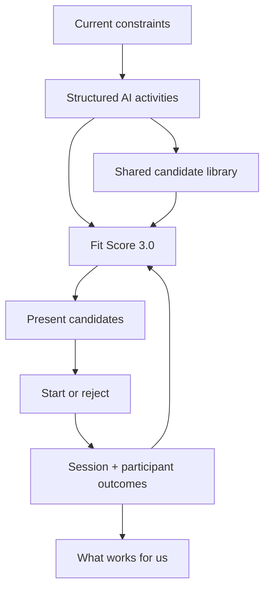
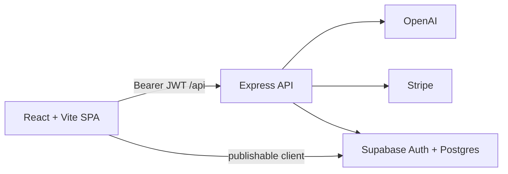

# FamilyFlow

A learning recommendation system for real family moments—not just “React + OpenAI kids activities.”

[Live Demo](https://familyflow.app) *(placeholder — set to your production URL when deployed)*

**React · Express · Supabase · OpenAI · Stripe · Playwright**

```text
constraints → structured activities → accept/reject → time-to-start →
outcomes → similar-moment learning → better recommendations
```

Parents name what they can handle *right now*. FamilyFlow generates structured activities with categories and traits, records which ideas are accepted or rejected, measures how quickly play begins, stores real session outcomes (including per-child participants), and improves the next recommendation with Fit Score 3.0 moment similarity—plus Plan B from a shared activity library so the common path does not need another OpenAI call.

## Screenshots

*Placeholders — drop real captures here when you have them.*

| Screen | What to show |
|--------|----------------|
| **Parent Moment** | Moment cards / Rescue Mode (10/20/30 → start) |
| **Kid Mode** | Energy + Simple vs Imaginative; “I’m Bored” |
| **Activity (Quest)** | Ranked cards, Plan B, timer, independence outcome |
| **Insights** | “What works for us” with min-sample honesty |

## Learning loop



## Architecture



Locally, Vite serves the SPA on `:5173` and proxies `/api` to Express on `:3001`. In production, Express serves `/api` and the built `dist/` SPA from one origin. Family data stays **backend-only** (service role); the browser does not get direct CRUD on learning tables.

## Engineering highlights

- **Structured taxonomy** — AI schema emits `categories` + `traits` (setup, structure, social mode, creativity, movement) persisted on sessions.
- **Participant outcomes** — Group sessions store per-child rows in `activity_session_participants`.
- **Behavioral telemetry** — `recommendation_batch_id` / `candidate_id`, durable time-to-start, explicit rejection reasons.
- **Fit Score 3.0** — Historical value = outcome × moment similarity × activity similarity × recency, boost clamped ±12.
- **Plan B + shared library** — Batch → cross-account shared candidates → presets → only then regenerate.
- **Rescue Mode 2.0** — Duration chip → low-setup pick with Plan B preloaded; no questionnaire.
- **What Works for Us** — Non-AI insights with minimum sample sizes (“Still learning” otherwise).
- **Product funnel analytics** — Batched `product_events` with session id + app version (no child names/notes).
- **AI cost accounting** — Tokens, estimated cost, response id; library hit rate for unit economics.
- **Households foundation** — Backfilled households + invites API; gradual `household_id` ownership.
- **PWA offline** — App shell, cached presets/rescue/plan-b GETs, offline analytics queue (never trusts cached subscription as auth).
- **Anonymous → permanent auth**, Stripe webhooks, Playwright CI isolation, rate limiting & CSP.

Longer product walkthrough: [`OWNERS_GUIDE.md`](./OWNERS_GUIDE.md). Portfolio narrative: [`docs/CASE_STUDY.md`](./docs/CASE_STUDY.md).

## Setup

1. Install dependencies:

```bash
npm install
```

2. Create environment files:

```bash
cp server/.env.example server/.env
cp .env.example .env
```

3. Fill required vars (see `server/.env.example` and `.env.example`).

   Billing needs `STRIPE_WEBHOOK_SECRET` at boot—locally run `stripe listen --forward-to localhost:3001/api/billing/webhook` and paste the `whsec_…` value.

4. Apply Supabase migrations so tables match the repo.

5. Start both processes:

```bash
npm run start:all
```

- Frontend: [http://localhost:5173](http://localhost:5173)
- Backend: [http://localhost:3001](http://localhost:3001)

In development, Vite proxies `/api` to the backend, so the frontend can use relative API URLs.

## E2E and CI

Playwright boots the app with `npm run start:all` and creates anonymous Supabase users. CI uses **local Supabase** (Docker via `supabase start`) so you only need one hosted Supabase project (production). Use Stripe **test-mode** keys (`sk_test_…`).

Locally (Docker required):

```bash
npx supabase start
# Copy API URL + anon + service_role from `npx supabase status` into .env / server/.env
npm run test:e2e
```

GitHub Actions splits CI into:

1. **Lint, test, and build** — runs on every PR and push to `main` (no cloud secrets)
2. **Playwright e2e** — runs **twice daily** (06:00 and 18:00 UTC) and on manual **Run workflow**; starts local Supabase, then runs Chromium against `127.0.0.1`. Does **not** run on PRs or pushes to `main`.

Required E2E GitHub secrets (no `TEST_SUPABASE_*`): `TEST_STRIPE_SECRET_KEY`, `TEST_STRIPE_WEBHOOK_SECRET`, `TEST_STRIPE_MONTHLY_PRICE_ID`, `TEST_STRIPE_ANNUAL_PRICE_ID`, `TEST_OPENAI_API_KEY`.

## Scripts

| Command | Purpose |
|---------|---------|
| `npm run start:all` | Start API + Vite together |
| `npm run dev` | Start Vite frontend only |
| `npm run server` | Start Express backend only |
| `npm run build` | Build frontend for production |
| `npm run preview` | Preview production build |
| `npm run lint` | Run ESLint |
| `npm run test` | Run Vitest unit tests |
| `npm run test:e2e` | Playwright golden paths (Chromium) |
| `npm run create-subscription-product` | One-time Stripe product/price helper |

## Notes

- Family settings (children, inventory, safety, current moment, parent presets, theme, kid-device mode) sync to Supabase for the signed-in user.
- Favorites, activity history, and activity sessions sync via family memory tables when signed in.
- Active quest / timer scratch state still uses browser `localStorage` for the current session.
- Offline UI may use cached presets/library; paid AI endpoints remain server-enforced when online.
- `server/.env` is gitignored. Never commit API keys.
